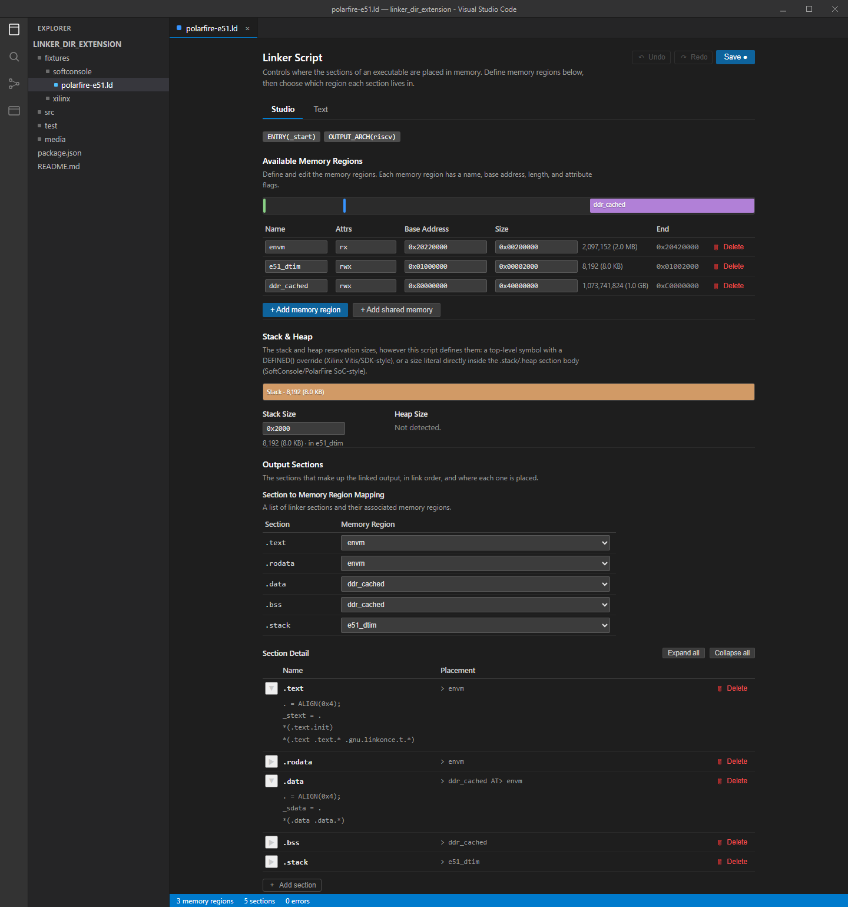

# Linker Script Studio

A VS Code extension that opens GNU `ld` linker scripts (`.ld`, `.lds`) as a
custom editor:

- **Studio**: memory regions as an always-editable table with a proportional
  address-space bar, a **Stack & Heap** section that edits the size however
  the script actually expresses it (a top-level symbol with a `DEFINED()`
  override on Xilinx Vitis/SDK, or a literal directly in the `.stack`/
  `.heap` section body on Microchip SoftConsole/PolarFire SoC -- detected
  automatically, with a small proportional bar), a "Section to Memory
  Region Mapping" table (each output section next to a dropdown of
  available regions, reassignable in one click), and an output-section
  tree with the full detail (input-section patterns, placement, symbols).
  Entry point, `OUTPUT_FORMAT`/`OUTPUT_ARCH`, and `INCLUDE`d files are
  summarized at the top. Add/edit/delete memory regions and output sections
  here, including a "+ Add shared memory" preset that adds a region plus a
  paired `(NOLOAD)` reserved section for a cross-core shared buffer.
- **Text**: a toggle within the same panel (not a second tab/file) showing
  the raw source, for anything Studio can't yet represent. Both views read
  from and write to the same local draft buffer, so switching back and
  forth never loses an edit either way.
- **Explicit Save, with undo/redo**: Studio edits build up in a local draft
  buffer, not applied to the real file on every keystroke -- nothing is
  written to the document (or disk) until you hit **Save** (button, or
  Ctrl+S) or the status bar's "Unsaved changes" indicator. Undo/Redo
  buttons (and Ctrl+Z/Ctrl+Shift+Z) step back and forth through Studio
  edits one at a time; the Text view's textarea additionally gets the
  browser's native per-keystroke undo while it's focused. A command palette
  escape hatch (`linkerScriptStudio.openAsText` / `...openAsStudio`) is
  still available for anyone who wants the file in a genuinely separate
  native-editor tab instead.



*Design mockup of the Studio view (built from the actual `media/main.css` design, rendered standalone against a real fixture's data) -- not yet a screenshot of the extension running inside VS Code, since that still needs an F5 smoke test to confirm. Design pulled from the sibling [binary-structure-inspector](https://marketplace.visualstudio.com/items?itemName=devdoesit.binary-structure-inspector) extension's own native-VS-Code styling.*

## Architecture

- `src/core/` -- pure parser/serializer/validator, **zero `vscode`/Node
  imports** (enforced at build time: `tsconfig.core.json` excludes the
  `node`/`vscode` type libs, so an accidental import fails `tsc`, not just
  code review). Usable from plain Node (that's what the Mocha tests run
  against) and reusable from the webview if ever needed.
  - `tokenizer.ts` / `parser.ts` -- GNU ld script grammar → `LinkerScript` model.
  - `serializer.ts` / `edits.ts` -- model mutations → text splices (see
    **Round-trip strategy** below).
  - `validate.ts` -- semantic checks (duplicate/undefined region references).
  - `expr.ts` -- a restricted, non-executing arithmetic evaluator for
    `ORIGIN`/`LENGTH` values. It folds literals and `+ - * / << >>`; anything
    else (symbol references, `LENGTH(REGION)`) is kept as an opaque `raw`
    string. **No code from a linker script is ever executed.**
- `src/extension.ts`, `src/linkerScriptEditorProvider.ts` -- the extension
  host (`vscode` imports allowed). Registers the `linkerScriptStudio.editor`
  custom text editor. It's a thin sync layer, not an editing layer: it
  tells the webview when the document changes outside of it, and writes
  the webview's draft back to the document (and disk) on an explicit Save
  -- see `shared/messages.ts` for why.
- `src/webview/` -- the Studio view's UI (vanilla DOM, no framework).
  Bundles `src/core` directly (it has zero vscode/Node imports, so it's
  safe in a browser context) and does all parsing/editing locally against
  its own draft text buffer; the host only hears about it on Save. Styled
  with `media/main.css` against VS Code's own theme variables (`--vscode-*`)
  rather than fixed colors, and uses `@vscode/codicons` (`media/codicon/`)
  for icon buttons so actions look native rather than like generic HTML
  form controls. The webview's `localResourceRoots` must cover every
  directory a resource is served from (`dist` for the bundle, `media` for
  the stylesheet and codicon font) -- too narrow a root doesn't error, it
  silently blocks the resource, so double-check this after adding a new
  webview asset directory.
- Two esbuild bundles: `dist/extension.js` (`platform: node`) and
  `dist/webview/main.js` (`platform: browser`), matching build targets to
  what's actually available in each context.

## Round-trip strategy (read before editing the parser)

Editing in the Studio view does **not** regenerate the whole file from the
model. The parser records the exact source byte-span of every top-level
construct (each `MEMORY` region, each output `SECTION`, each top-level
directive). An edit computes a small set of `TextEdit` splices against the
**original source text** and applies only those -- everything outside an
edited node's span (comments, blank-line grouping, unrelated
regions/sections, indentation elsewhere in the file) survives byte-for-byte.

The explicit tradeoff: a node that **is** edited has its entire span
replaced by canonical pretty-printed text, so that node's own internal
comments/formatting are not preserved, and a newly added region/section is
appended with no comment. The Text view is the escape hatch either way --
nothing is only editable through the lossy path.

## Scope

Implements the common real-world subset of the ld script grammar:
`MEMORY`, `SECTIONS` (input-section patterns, `KEEP`, `ALIGN`, symbol/
`PROVIDE` assignments, `>`/`AT>`/`AT()` placement), and the usual top-level
directives. Unrecognized constructs produce a parse-error diagnostic rather
than crashing or silently corrupting the file.

**Explicitly out of scope (first pass):** scripts that require the C
preprocessor before they're valid ld syntax (`#include`/`#define`/`#if` at
BSP-generated files sometimes do this). These are detected up front
(`detectNeedsPreprocessor`); the Studio view shows a notice and falls back
to the Text view, rather than producing a broken parse.

## Development

```
npm install
npm run check-types  # tsc --noEmit against all three tsconfigs (core/host/webview)
npm run lint
npm test             # Mocha, plain Node -- no extension host required
npm run build         # esbuild, both bundles (dev: sourcemaps, unminified)
npm run package       # produces linker-script-studio-<version>.vsix
```

`npm run package` cleans any stale `.vsix`, type-checks, then runs `vsce
package`, whose own `vscode:prepublish` hook runs the **production** build
(`build:prod`: minified, no sourcemaps) -- don't add a separate production
build step to the `package` script, `vsce` already triggers one, and running
both just means the second (non-production) build silently wins.

Press F5 in VS Code (with the `.vscode/launch.json` Extension Development
Host config) to try it against `fixtures/xilinx/lscript.ld` or
`fixtures/softconsole/polarfire-e51.ld`.

The fixtures under `fixtures/` are representative, hand-trimmed excerpts
reconstructed from well-known Xilinx Vitis/SDK and Microchip SoftConsole
conventions, not literal vendor files. `examples/` now holds real,
unmodified vendor linker scripts (a Xilinx one and a PolarFire SoC
DDR-loaded-by-bootloader one) -- worth promoting into `fixtures/` and
wiring into the fixture tests, since real files are what actually surfaces
grammar edge cases.
